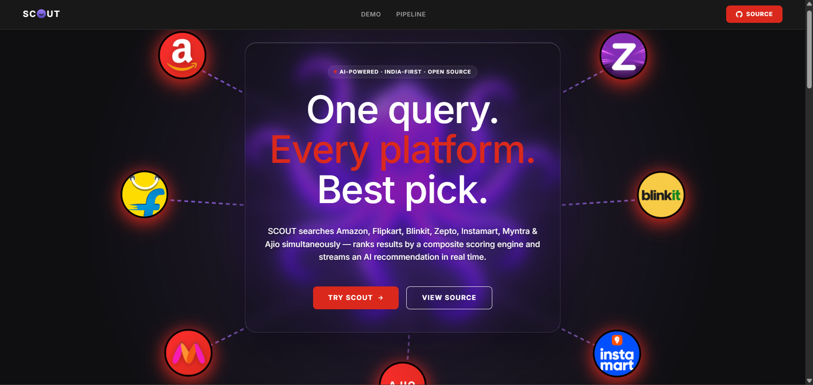
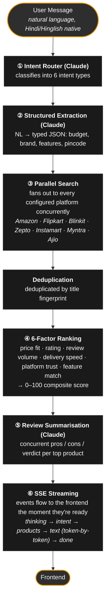
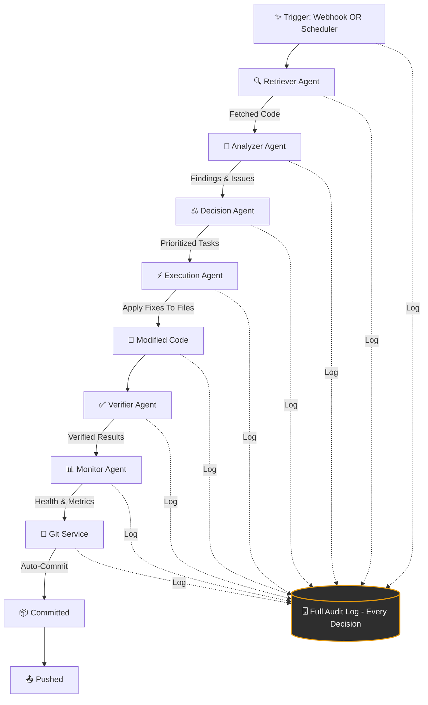

<div align="center">

# SCOUT
[https://scout-server.pages.dev/]
### Smart Commerce & Omnichannel Unified Tracker

**One query. Every platform. Best pick.**

SCOUT is an AI-powered shopping assistant that searches Amazon, Flipkart, Blinkit, Zepto, Instamart, Myntra & Ajio simultaneously — ranks every result through a transparent 6-factor scoring engine, and streams a natural-language recommendation back in real time.

[Live Demo](#) · [API Docs](#api-reference) · [Report a Bug](https://github.com/4-thkind/SCOUT/issues)


</div>

---

## Why SCOUT

Shopping across Indian e-commerce means opening seven tabs, comparing prices by hand, and second-guessing which platform actually has the fastest delivery. SCOUT collapses that into a single chat message:



> **"best wireless headphones under ₹3000"**

...and in under a second, it's already searching, ranking, and narrating a verdict — not just a list of links, but an actual recommendation with reasoning.

```text
You:   best wireless headphones under ₹3000 🎧

SCOUT: The Sony WH-CH520 is your best pick — 50h battery, USB-C charging,
       and Sony's DSEE upscaling at ₹2,990 from Flipkart. If budget is
       tighter, the boAt Rockerz 450 at ₹1,299 punches well above its
       price with 15h playtime and solid bass.

       ┌─────────────────────────────┬────────┬────────┬──────────┐
       │ Product                     │ Price  │ Score  │ Delivery │
       ├─────────────────────────────┼────────┼────────┼──────────┤
       │ Sony WH-CH520 (Flipkart)    │ ₹2,990 │ 94/100 │ 3 days   │
       │ boAt Rockerz 450 (Amazon)   │ ₹1,299 │ 88/100 │ 2 days   │
       │ JBL Tune 520BT (Amazon)     │ ₹2,499 │ 81/100 │ 1 day    │
       └─────────────────────────────┴────────┴────────┴──────────┘
```

---

## How It Works

Six sequential stages, each powered by a specialized component — no hardcoded logic, the LLM drives routing, extraction, and narration end to end.



---

## Core Agent Pipeline



---

## Key Design Decisions

Built as a ground-up rearchitecture of an earlier prototype (ShoppingGPT), fixing the problems that don't show up until real users hit it:

| Problem in the original prototype                     | Solution in SCOUT                                                    |
| ------------------------------------------------------- | ---------------------------------------------------------------------- |
| Global shared memory across all users                 | Per-session objects, UUID-keyed, Redis or in-memory TTL cache        |
| Keyword-based router — breaks on Hindi/Hinglish        | LLM (Claude) intent router — handles slang, Hinglish, typos natively |
| Synchronous request/response only                     | FastAPI async + Server-Sent Events, streaming from first token       |
| Hardcoded local paths, no env config                   | `pydantic-settings`, fully environment-driven                        |
| Single local product database                          | Live multi-platform API integrations with caching                    |
| No deduplication across platforms                      | Title-fingerprint dedup before results ever reach the ranker         |
| No product scoring                                     | Transparent 6-factor weighted scoring engine, not a black box        |
| No review summarisation                                | Claude-generated pros/cons/verdict per product, computed concurrently |
| No streaming                                            | Full SSE pipeline — badges, intent echo, product cards, live tokens  |

---

## Project Structure

This repo contains both halves of SCOUT:

```
SCOUT/
├── Backend/                 FastAPI service — see below
│   ├── app/
│   │   ├── main.py             app factory
│   │   ├── config.py           environment-driven settings
│   │   ├── agent/               core.py, router.py, prompts.py
│   │   ├── tools/                intent extraction, search, ranking, review summarisation
│   │   ├── integrations/         one module per platform (Amazon, Flipkart, Blinkit, Zepto…)
│   │   ├── models/               Product, SearchIntent, Session, API schemas
│   │   └── services/             LLM wrapper, cache, per-user session isolation
│   └── requirements.txt
│
├── frontend/                 Landing page + interactive demo (static, no build step)
│   ├── index.html
│   ├── styles.css              design tokens lifted straight from DESIGN.md
│   └── script.js                scroll reveal + demo chat interactivity
│
├── DESIGN.md                 Design system: colors, type scale, spacing, component tokens
└── README.md                 you are here
```

---

## Tech Stack

| Layer      | Stack |
|------------|-------|
| Backend    | Python, FastAPI, async/await, Server-Sent Events |
| LLM        | Claude — intent routing, structured extraction, review summarisation, narration |
| Search     | SerpAPI (Google Shopping) day 1 → Amazon PA-API, Flipkart Affiliate API, quick-commerce partnerships |
| Caching    | Redis with local in-memory fallback |
| Frontend   | Vanilla HTML / CSS / JS — no framework, no build step, deploys as static files |
| Design     | Custom token system defined in [`DESIGN.md`](./DESIGN.md) — warm near-black canvas, single amber accent, pill-shaped UI |

---

## Quick Start

### Backend

```bash
cd Backend
python -m venv venv && source venv/bin/activate
pip install -r requirements.txt

cp .env.example .env
# add GEMINI_API_KEY and SERP_API_KEY at minimum

python run.py
# → http://localhost:8000
# → http://localhost:8000/docs            interactive API docs
# → http://localhost:8000/api/health      check which platforms are configured
```

### Frontend

```bash
cd frontend
# no build step — just serve the static files
python -m http.server 5500
# → http://localhost:5500
```

Point the demo chat at your local backend by updating the fetch URL in `script.js` if you're not running both on the same origin.

---

## API Reference

### `POST /api/chat` — SSE streaming

```jsonc
// Request
{
  "message": "best wireless headphones under ₹3000",
  "session_id": "abc123",   // optional — server creates one if omitted
  "pincode": "110001"       // optional — enables delivery ETAs
}

// SSE events
event: thinking  → { "message": "Searching across platforms…" }
event: intent    → { "query_text": "...", "budget_max": 3000, ... }
event: products  → { "products": [...], "platforms_searched": [...] }
event: text      → "Best pick is…"        // token-by-token
event: done      → { "session_id": "abc123" }
```

### `GET /api/search` — non-streaming

```
GET /api/search?q=wireless+headphones&budget=3000&pincode=110001&sort=best_value
```

### `GET /api/health`

```json
{
  "status": "ok",
  "llm_connected": true,
  "platforms_configured": ["serp", "amazon", "flipkart"],
  "cache_connected": false
}
```

### Frontend integration example (React / Next.js)

```ts
export function useChat() {
  const [messages, setMessages] = useState<Message[]>([]);
  const [products, setProducts] = useState<ProductCard[]>([]);

  const sendMessage = async (text: string, sessionId?: string) => {
    const res = await fetch('/api/chat', {
      method: 'POST',
      headers: { 'Content-Type': 'application/json' },
      body: JSON.stringify({ message: text, session_id: sessionId }),
    });

    const reader = res.body!.getReader();
    const decoder = new TextDecoder();
    let aiText = '';

    while (true) {
      const { done, value } = await reader.read();
      if (done) break;

      for (const line of decoder.decode(value).split('\n')) {
        if (!line.startsWith('data:')) continue;
        const chunk = JSON.parse(line.slice(5));
        if (chunk.type === 'text')     aiText += chunk.data;
        if (chunk.type === 'products') setProducts(chunk.data.products);
        if (chunk.type === 'done')     setMessages(m => [...m, { role: 'assistant', content: aiText }]);
      }
    }
  };

  return { messages, products, sendMessage };
}
```

---

## Environment Variables

| Variable                                             | Description                       | Required  |
| ------------------------------------------------------ | ------------------------------------ | ----------- |
| `GEMINI_API_KEY`                                      | Claude API key                    | ✅ Yes    |
| `SERP_API_KEY`                                        | SerpAPI key for Google Shopping   | ✅ Day 1  |
| `AMAZON_ACCESS_KEY` / `SECRET_KEY` / `PARTNER_TAG`     | Amazon PA-API 5.0                 | ✅ Week 1 |
| `FLIPKART_AFFILIATE_ID` / `TOKEN`                      | Flipkart Affiliate API            | ✅ Week 1 |
| `BLINKIT_API_KEY` / `BASE_URL`                         | Blinkit (via partnership)         | 🔜 Future |
| `ZEPTO_API_KEY` / `BASE_URL`                           | Zepto (via partnership)           | 🔜 Future |
| `INSTAMART_API_KEY` / `BASE_URL`                       | Swiggy Instamart                  | 🔜 Future |
| `REDIS_URL`                                            | Redis for caching + sessions      | Optional  |

---

## Adding a New Platform

SCOUT's integration layer is a plugin architecture — new platforms don't touch core logic:

1. Create `Backend/app/integrations/<platform>.py` extending `BaseIntegration`
2. Implement `async def search(intent, pincode) -> List[Product]`
3. Register it in `_ECOMMERCE_PLATFORMS` or `_QUICK_COMMERCE_PLATFORMS` in `product_search.py`
4. Add its API keys to `app/config.py` and `.env.example`

---

## Design System

The frontend's visual language — warm near-black canvas, a single disciplined amber accent, pill-shaped buttons/badges, bold display type with italic emphasis — is fully specified as a reusable token system in [`DESIGN.md`](./DESIGN.md). Hand that file to any design tool or AI agent to extend the UI consistently.

---

## Roadmap

- [ ] Live Amazon PA-API + Flipkart Affiliate integration (currently SerpAPI-backed)
- [ ] Blinkit / Zepto / Instamart quick-commerce partnerships
- [ ] Redis-backed session store for production deployments
- [ ] Price-drop tracking and alerts
- [ ] Public hosted demo

---


<div align="center">

Built by [Utkarsh Singh](https://github.com/4-thkind) and [Granth Chhabra](https://github.com/granthx)

</div>
