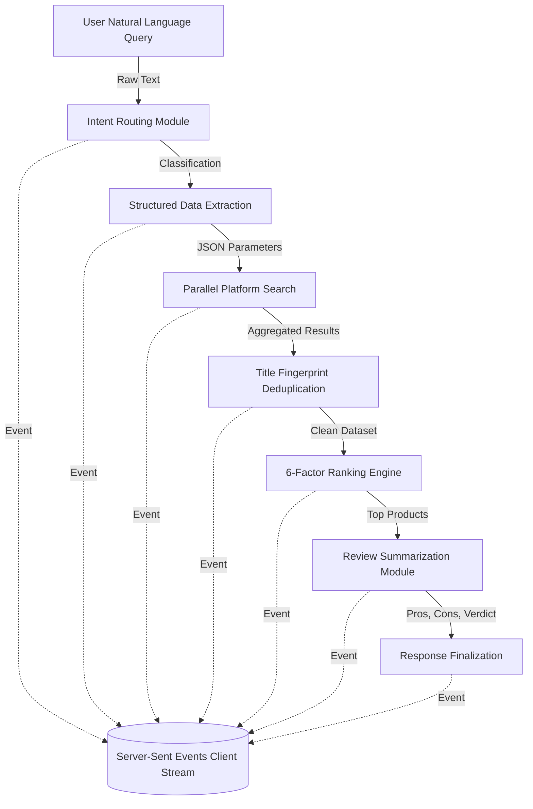

<div align="center">

# SCOUT
**Smart Commerce & Omnichannel Unified Tracker**

[Live Deployment](https://scout-server.pages.dev/) | [Report a Bug](https://github.com/4-thkind/SCOUT/issues)

SCOUT is an intelligent shopping assistant that searches multiple e-commerce platforms simultaneously. It ranks results using a multi-factor scoring engine and streams a structured recommendation back to the client in real-time.

</div>

---

## Overview

Modern e-commerce requires manual price comparison across multiple fragmented platforms. SCOUT automates this by collapsing the search, comparison, and evaluation process into a single interface. 

Users submit natural language queries. The system processes the intent, fetches real-time data from platforms like Amazon, Flipkart, Myntra, and quick-commerce providers, ranks the products, and streams a summarized recommendation based on real data.

## Architecture and Pipeline



The backend executes a six-stage pipeline powered by a large language model and parallel asynchronous requests. The process begins with **Intent Routing**, where the system classifies the user's natural language input into predefined intent categories. Following classification, **Structured Extraction** parses the raw input into a strict JSON schema containing definitive parameters such as maximum budget, preferred brand, required features, and specific delivery criteria.

Once the parameters are extracted, the backend initiates a **Parallel Search** phase. It fans out concurrent asynchronous requests to all configured e-commerce platforms. To maintain data integrity, the aggregated results immediately undergo deduplication using title fingerprinting algorithms. The deduplicated dataset is then passed to the **Weighted Ranking** engine. This engine evaluates every product against a six-factor scoring model that considers price fit, user ratings, review volume, delivery speed, platform trust, and feature match, ultimately assigning a composite score out of 100.

The top-ranked products are sent to the **Review Summarization** module, which concurrently analyzes historical reviews to generate structured pros, cons, and a definitive verdict. Finally, through **Streaming Response**, the application utilizes Server-Sent Events (SSE) to stream the operational states—parsing, searching, and scoring—along with the final text generation back to the client in real-time.

## Key Engineering Decisions

SCOUT implements per-session objects keyed by UUID with Redis or in-memory TTL caching to handle **State Management**, deliberately avoiding global shared state architecture. For **Natural Language Processing**, it replaces legacy keyword-based routing with an advanced LLM-driven router capable of handling mixed languages, slang, and typographical errors natively. 

To ensure optimal performance, the system relies on **Asynchronous Execution**. Built on FastAPI with strict `async/await` patterns, it handles concurrent API requests and streams responses without blocking the main event loop. Furthermore, **Data Deduplication** is executed before results reach the ranking engine, ensuring that computational resources are not wasted scoring duplicate listings across different platforms. The entire application relies on environment-driven **Configuration Management** using `pydantic-settings` to ensure seamless deployments across development and production environments.

## Repository Structure

```text
SCOUT/
├── Backend/
│   ├── app/
│   │   ├── main.py             (FastAPI application factory)
│   │   ├── config.py           (Environment settings)
│   │   ├── agent/              (Core logic, routers, prompts)
│   │   ├── tools/              (Extraction, search, ranking algorithms)
│   │   ├── integrations/       (Platform-specific API clients)
│   │   ├── models/             (Pydantic schemas)
│   │   └── services/           (LLM client, cache, session management)
│   └── requirements.txt
│
├── Frontend/
│   ├── index.html              (Static markup)
│   ├── styles.css              (Design tokens and layout)
│   └── script.js               (DOM manipulation and SSE client)
│
└── DESIGN-ferrari.md           (Design system specifications)
```

## Technology Stack

- **Backend**: Python, FastAPI, Server-Sent Events
- **Intelligence**: Large Language Model for routing, extraction, and summarization
- **Data Providers**: SerpAPI, Affiliate APIs (Amazon, Flipkart), Direct Partnerships
- **Storage**: Redis (with local fallback)
- **Frontend**: Vanilla HTML/CSS/JavaScript (Zero build-step)

## Local Development Setup

### Backend

```bash
cd Backend
python -m venv venv
source venv/bin/activate  # On Windows use: venv\Scripts\activate
pip install -r requirements.txt

cp .env.example .env
# Configure required API keys in .env

python run.py
```

The API will be available at `http://localhost:8000`. 
Interactive documentation is available at `http://localhost:8000/docs`.

### Frontend

The frontend consists of static files and requires no bundler.

```bash
cd Frontend
python -m http.server 8000
```

Configure `script.js` to point to your local or remote backend URL.

## API Specification

### POST /api/chat

Initiates a streaming chat session.

**Request**
```json
{
  "message": "wireless headphones under 3000",
  "session_id": "optional-uuid",
  "pincode": "optional-pincode"
}
```

**Response (Server-Sent Events)**
```text
event: thinking
data: {"message": "Searching platforms"}

event: intent
data: {"query_text": "...", "budget_max": 3000}

event: products
data: {"products": [...], "platforms_searched": [...]}

event: text
data: "The best pick is..."

event: done
data: {"session_id": "..."}
```

## Environment Configuration

| Variable | Description | Requirement |
|---|---|---|
| `LLM_API_KEY` | Primary API key for the language model | Required |
| `SERP_API_KEY` | SerpAPI key for search aggregation | Required |
| `REDIS_URL` | Redis connection string | Optional |
| `AMAZON_ACCESS_KEY` | Amazon PA-API 5.0 credentials | Optional |
| `FLIPKART_AFFILIATE_ID` | Flipkart Affiliate credentials | Optional |

## Adding Platform Integrations

The system uses a modular plugin architecture for search platforms:

1. Create `Backend/app/integrations/<platform>.py` extending `BaseIntegration`.
2. Implement the `async def search(intent, pincode)` method.
3. Register the integration in `product_search.py`.
4. Add corresponding authentication keys to `config.py` and `.env`.

---

<div align="center">
Built by Utkarsh Singh and Granth Chabbra.
</div>
